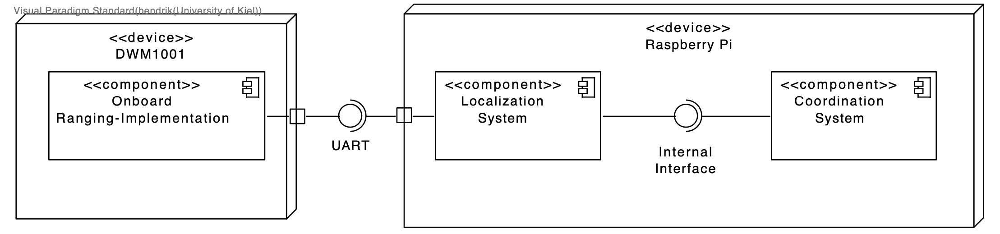

Welcome the KIEL (Kiel Intelligent Entity Localization) project.

Overview
--------

* Motivation
* Goals
* State of the Project
* Basic Building Blocks

Resources
---------

In the resources you will find our presentation as well as additional material.

Building the documentation
^^^^^^^^^^^^^^^^^^^^^^^^^^

Run ``make html`` inside the ``resources`` directory to generate documentation for this project.

Evaluation Data
^^^^^^^^^^^^^^^

The ``evaluation-data`` directory contains raw evaluation data.
See the scripts in for example: ``components/localization/evaluation`` to interpret these and generate graphs.

Components
----------

Setup / Usage
-------------

The Instructions on how to set up and run each component can be found in their respective readme:
``components/<name>/README.rst``.  Generally you need an instance of the camera server running in
the same network as the cars.  Each car has to run the ``coordination`` as well as the
``localization`` module and be connected to an ultrawideband transceiver running the ``ranging``
software.
